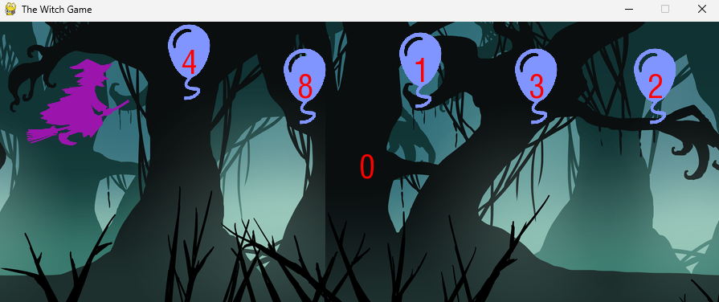

# Witch Game

This is a small project I build with pygame module of python. Here is the game's interface:


Player press the number of the balloons to gain point.
___
The balloons move from the right to the left. If it touch the witch, you will lose. Press Enter to play again :


High score will also be saved.

Run the game:
___
```
pip install pygame
python game.py
```

